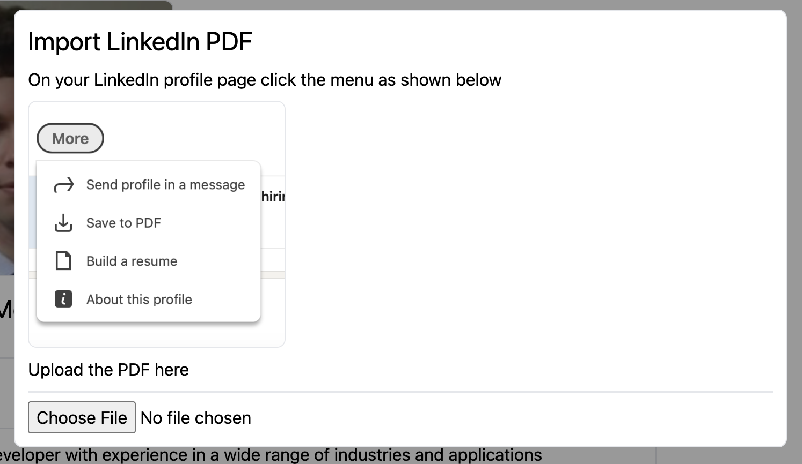
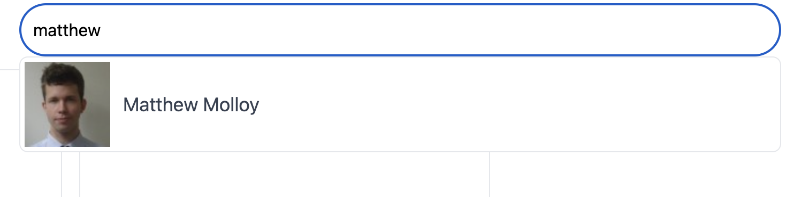
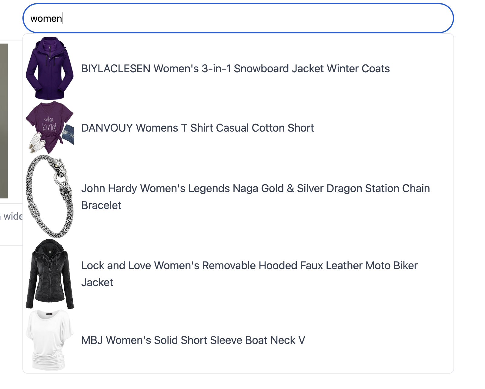

# SimpleUI launchpoint

Demo [SimpleUI](https://simpleui.io) app with open source components.  From here developing a custom app is very straightforward.

## Usage

Visit [launchpoint.simpleui.io](https://launchpoint.simpleui.io) or run locally using the instructions below.

### Account Creation

Register your account and a dashboard will appear.  Click the profile pic to edit your CV.
Save typing by importing your profile directly from LinkedIn



### Users

Search for users using the omnibar at the top of the main dashboard.
Click on search results to view their impressive resumes.



### Shopping

Search for shop items using the omnibar at the top of the dashboard.



Purchase items on the results page. The checkout is connected to a test Stripe account which accepts card `4242 4242 4242 4242`.

## Developer Usage

Start a [REPL](#repls) in your editor or terminal of choice.

Start the server with:

```clojure
(go)
```

System configuration is available under `resources/system.edn`.

To reload changes:

```clojure
(reset)
```

## REPLs

### Cursive

Configure a [REPL following the Cursive documentation](https://cursive-ide.com/userguide/repl.html). Using the default "Run with IntelliJ project classpath" option will let you select an alias from the ["Clojure deps" aliases selection](https://cursive-ide.com/userguide/deps.html#refreshing-deps-dependencies).

### CIDER

Use the `cider` alias for CIDER nREPL support (run `clj -M:dev:cider`). See the [CIDER docs](https://docs.cider.mx/cider/basics/up_and_running.html) for more help.

Note that this alias runs nREPL during development. To run nREPL in production (typically when the system starts), use the kit-nrepl library through the +nrepl profile as described in [the documentation](https://kit-clj.github.io/docs/profiles.html#profiles).

### Command Line

Run `clj -M:dev:nrepl` or `make repl`.

Note that, just like with [CIDER](#cider), this alias runs nREPL during development. To run nREPL in production (typically when the system starts), use the kit-nrepl library through the +nrepl profile as described in [the documentation](https://kit-clj.github.io/docs/profiles.html#profiles).

### Internationalization

Launchpoint supports any language, simply run

```clojure
(simpleui.launchpoint.i18n/spit-phrases)
```

This will spit out `i18n.txt` which contains all the English phrases.  To add e.g. Japanese, put matching phrases below
each line of English.  Next save the file with its language code `resources/i18n/jp.txt`.  Finally add an entry to
`simpleui.launchpoint.web.views.lang/lang-disp` to make it available for users.
